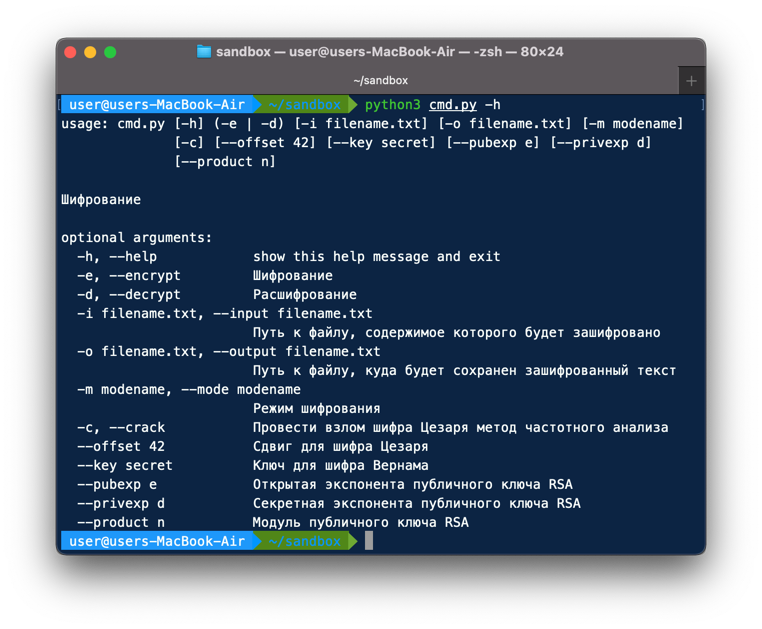
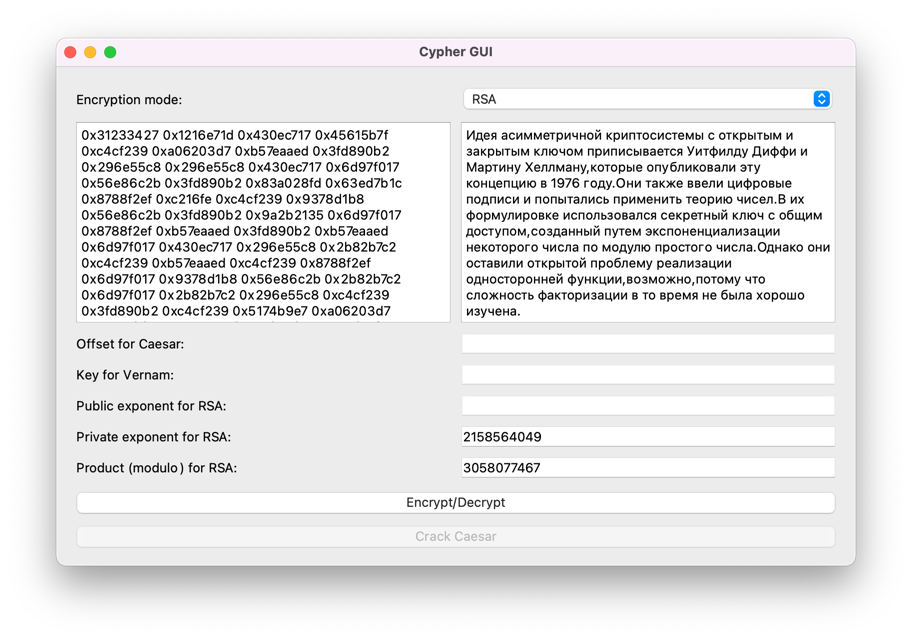

# Encryption
Проект "Шифрование", задание Review 1 по курсу Python в МФТИ.

## Возможности:
Эта программа реализует следующие способы шифрования:
 - [Шифр Цезаря](https://ru.wikipedia.org/wiki/%D0%A8%D0%B8%D1%84%D1%80_%D0%A6%D0%B5%D0%B7%D0%B0%D1%80%D1%8F)
 - [Шифр Вернама](https://ru.wikipedia.org/wiki/%D0%A8%D0%B8%D1%84%D1%80_%D0%92%D0%B5%D1%80%D0%BD%D0%B0%D0%BC%D0%B0)
 - [RSA](https://ru.wikipedia.org/wiki/RSA)

Это значит, что можно провести шифрование/дешифрование текста, используя эти алгоритмы шифрования. Шифры Цезаря и
Вернама, в силу своих особенностей, зашифруют только английские символы сообщения, оставляя остальные нетронутыми.

Также программа предоставляет возможность проведения взлома Шифра Цезаря
[методом частотного анализа](https://ru.wikipedia.org/wiki/%D0%A7%D0%B0%D1%81%D1%82%D0%BE%D1%82%D0%BD%D1%8B%D0%B9_%D0%B0%D0%BD%D0%B0%D0%BB%D0%B8%D0%B7).

Можно запустить программу из командной строки:

А также воспользоваться графическим интерфейсом:

Наконец, программа содержит в себе скрипт для генерации RSA-ключей.

## Составляющие
 - cypher.py - неисполняемый файл, содержащий класс Cypher, реализующий шифрование
 - cmd.py - исполняемый файл, с его помощью программа запускается в командной строке
 - gui.py - исполняемый файл, с его помощью программа запускается в окне
 - keygen.py - исполняемый файл для генерации RSA-ключей

Для работы графического интерфейса необходима библиотека PyQt5.

## Использование
Графический интерфейс достаточно понятен для использования без дополнительной информации, поэтому
рассмотрим подробнее использование в терминале.

Чтобы запустить программу в терминале, нужно выполнить команду `python3 cmd.py`. Справка доступна по команде `python3 cmd.py -h`.

У файла `cmd.py` есть несколько опций запуска, рассмотрим их:
1. `-h` - справка
2. `-e` и `-d` - обязательно указать ровно 1 флаг из этих двух. Они задают режим работы программы. `-e` означает шифрование, 
`-d` - дешифрование.
3. `-i`, `--input` - необязательный флаг, задающий файл, текст которого будет зашифрован/расшифрован. По умолчанию равен _input.txt_.
4. `-o`, `--output` - необязательный флаг, задающий файл, в который будет записан результат. По умолчанию равен _output.txt_.
5. `-m`, `--mode` - необязательный флаг, устанавливающий, какой шифр будет использован. Может принимать только 3 
возможных значения: _Caesar_ (Цезаря), _Vernam_ (Вернама), _RSA_. По умолчанию равен _Caesar_.
6. `-c`, `--crack` - флаг, установка которого указывает, что нужно провести не дешифровку, а взлом частотным анализом.
Может быть использован только вместе с флагами `-d` и `-m Caesar`.
7. `--offset` - необязательный флаг, задающий сдвиг для Шифра Цезаря. По умолчанию равен _42_.
8. `--key` - необязательный флаг, задающий ключ для шифра Вернама. По умолчанию равен _secret_.
9. `--pubexp` - флаг, задающий публичную экспоненту — часть публичного ключа RSA. Флаг обязателен при флагах `-e` и `-m RSA`.
10. `--privexp` - флаг, задающий закрытую экспоненту — часть приватного ключа RSA. Флаг обязателен при флагах `-d` и `-m RSA`.
11. `--product` - флаг, задающий модуль — часть ключа RSA. Флаг обязателен при флаге `-m RSA`.

Несколько примеров использования:

`python3 cmd.py -d -i topsecretmsg.txt -o natural.txt --crack` — атака частотным анализом на содержимое файла _topsecretmsg.txt_,
запись результата в файл _natural.txt_.

`python3 cmd.py -e -o destination.txt -m Vernam --key ofcourseistillloveyou` — ширфрование содержимого файла _input.txt_ шифром Вернама
с ключем _ofcourseistillloveyou_, запись результата в файл _destination.txt_.

У файла `keygen.py` есть 2 флага:
1. `-h` - справка
2. `-l`, `--length` - необязательный флаг, задающий длину RSA ключей в битах. По умолчанию равен 16.
3. `-s`, `--seed` - необязательный флаг, задающий seed для генератора псевдослучайных чисел, используемого скриптом.
По умолчанию не имеет значения, то есть при разных запусках будет разный seed.

Пример использования:
`python3 keygen.py -l 256 -s 2022` - генерация ключей длины 256 бит, seed генератора 2022.